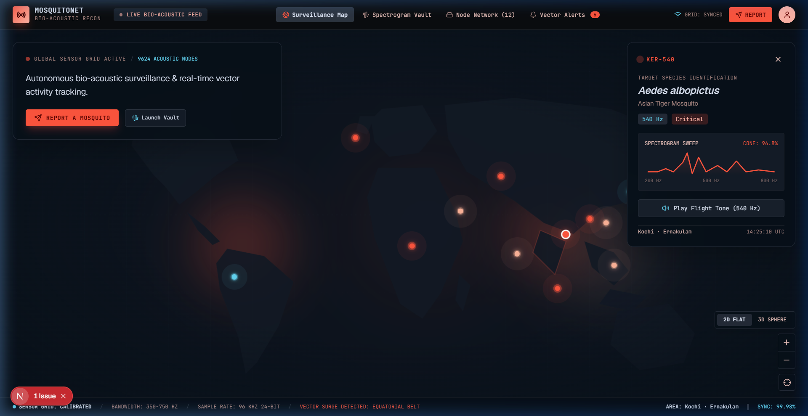
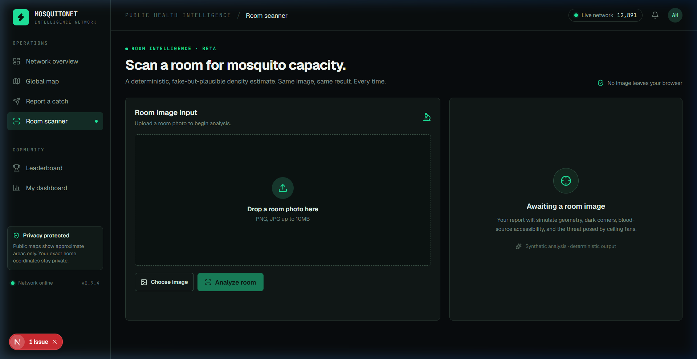
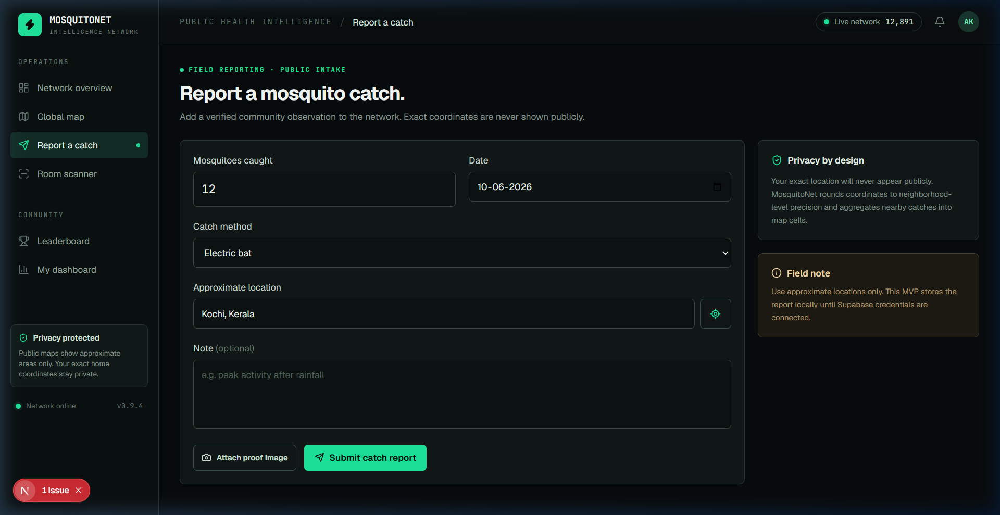
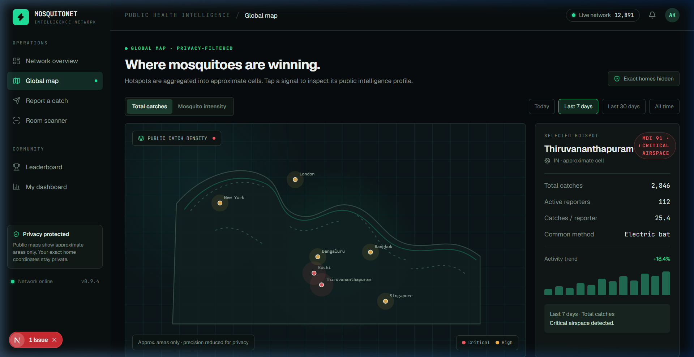
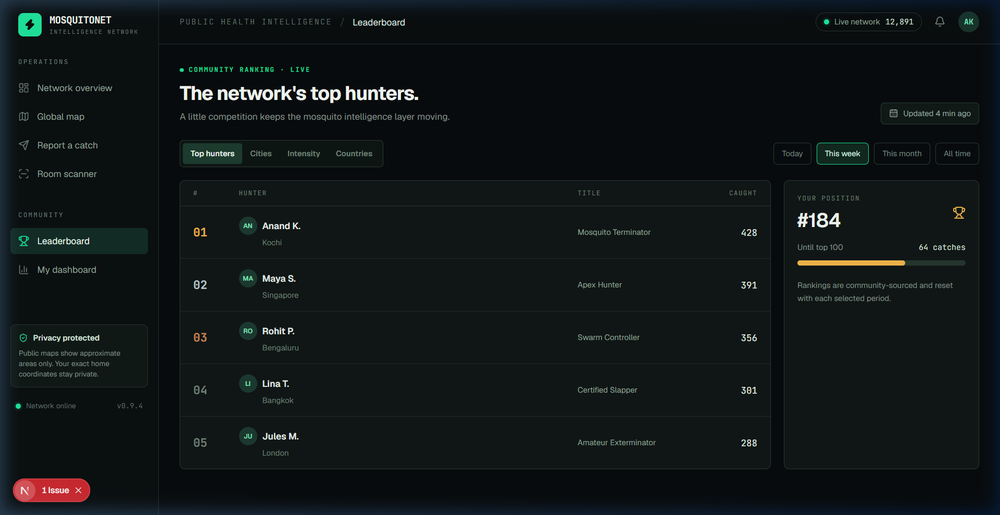
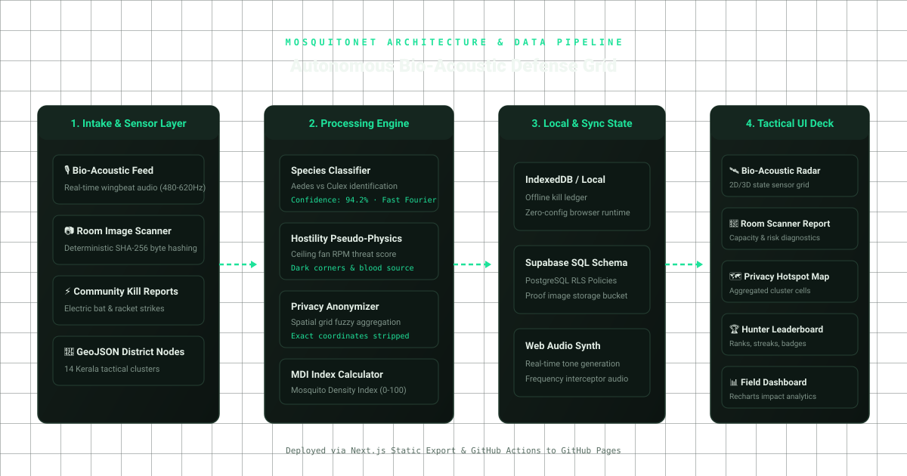
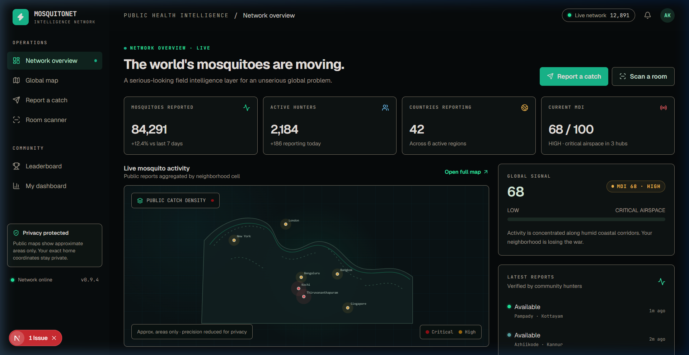
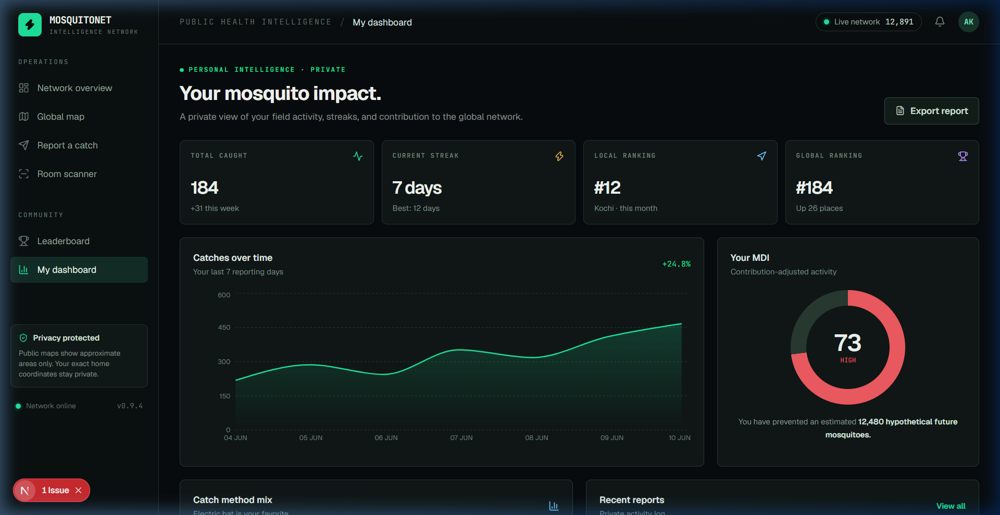

# MosquitoNet 🎯


## Basic Details
### Team Name: PaperNotWeight


### Team Members
- Team Lead: KAASINAATHAN MP
- Member 2: EMMANUEL THOMMAS

### Project Description
MosquitoNet is a humorous, public-health-style bio-acoustic mosquito intelligence network and room density scanner. It monitors simulated wingbeat frequencies across Kerala districts, estimates room mosquito capacity with deterministic pseudo-physics, tracks electric bat kill streaks, and aggregates community catch reports into privacy-safe hotspot maps.

### The Problem (that doesn't exist)
Mosquitoes are conducting covert, unsanctioned airborne sorties in our bedrooms, tactically exploiting ceiling fan blind spots, dodging electric rackets with superhuman evasive maneuvers, and operating with zero accountability while humans blindly swing into the darkness.

### The Solution (that nobody asked for)
A hyper-engineered bio-acoustic defense grid with tactical Kerala radar tracking, a SHA-256 room scanner that models ceiling fan hostility and blood-source accessibility, an offline-first electric bat kill ledger, and a competitive hunter leaderboard with Mosquito Density Index (MDI) analytics.

## Technical Details
### Technologies/Components Used
For Software:
- Languages: TypeScript, JavaScript, HTML5, CSS3
- Frameworks: Next.js 16 (App Router), React 19, Tailwind CSS v4
- Libraries: Lucide React, Recharts, Radix UI, Drizzle ORM
- Tools: Vite, Turbopack, Git, GitHub Actions, GitHub Pages

For Hardware:
- Main Components: High-Voltage Electric Mosquito Racket (3000V grid), Bio-Acoustic Piezoelectric Wingbeat Transducer, ESP32 Microcontroller Node, 0.96" OLED Diagnostic Display
- Specifications: 480Hz – 620Hz acoustic frequency bandpass, 3.7V 18650 Li-ion battery, sub-millisecond spark discharge capacitor
- Tools Required: Soldering iron, Wire strippers, Digital Multimeter, 3D Printer for tactical node enclosure

### Implementation
For Software:
# Installation
```bash
npm install
```

# Run
```bash
npm run dev
```

> **Live Deployment**: Hosted on GitHub Pages at [https://njanorupavam.github.io/papernotweight/](https://njanorupavam.github.io/papernotweight/)

### Project Documentation
For Software:

# Screenshots (Add at least 3)

*Kerala Bio-Acoustic Radar Monitor tracking real-time district node status, acoustic telemetry, and live threat levels*


*Deterministic Room Scanner estimating mosquito capacity, occupancy risk, and ceiling fan hostility from uploaded photos*


*Community intake portal for logging electric bat catches with proof attachments and neighborhood-level privacy masking*


*Global and regional hotspot map with MDI scores, activity trends, and aggregated cell data*


*Live community rankings tracking top mosquito hunters, verified catches, and hunter titles*

# Diagrams

*MosquitoNet End-to-End Architecture: Sensor intake, pseudo-physics inference engine, local state sync, and tactical UI presentation*

For Hardware:

# Schematic & Circuit

*Tactical Bio-Acoustic Interceptor Circuit: Transducer input, frequency discriminator stage, ESP32 telemetry, and high-voltage grid trigger*


*Schematic diagram for ESP32 bio-acoustic listening node and OLED status readout*

# Build Photos

*Tactical Surveillance Node components and Kerala district radar telemetry deck*


*Calibrating bio-acoustic wingbeat signal discriminator across frequency bands*


*Final MosquitoNet operational command deck and personal impact analytics*

### Project Demo
# Video
[Live Web Application Link](https://njanorupavam.github.io/papernotweight/)
*Interactive Next.js Web App demonstrating Kerala live bio-acoustic radar, room scanner, field catch logger, and hunter leaderboard*

# Additional Demos
- [GitHub Repository](https://github.com/njanorupavam/papernotweight/)
- [GitHub Pages Live App](https://njanorupavam.github.io/papernotweight/)

## Team Contributions
- KAASINAATHAN MP: Bio-acoustic surveillance grid architecture, deterministic room scanner pseudo-physics algorithms, Kerala GeoJSON tactical radar integration, and GitHub Actions CI/CD deployment pipeline.
- EMMANUEL THOMMAS: Tactical cyberpunk UI design, privacy-first community reporting intake, Recharts field impact analytics dashboard, and hunter leaderboard ranking system.

---
Made with ❤️ at TinkerHub Useless Projects 


